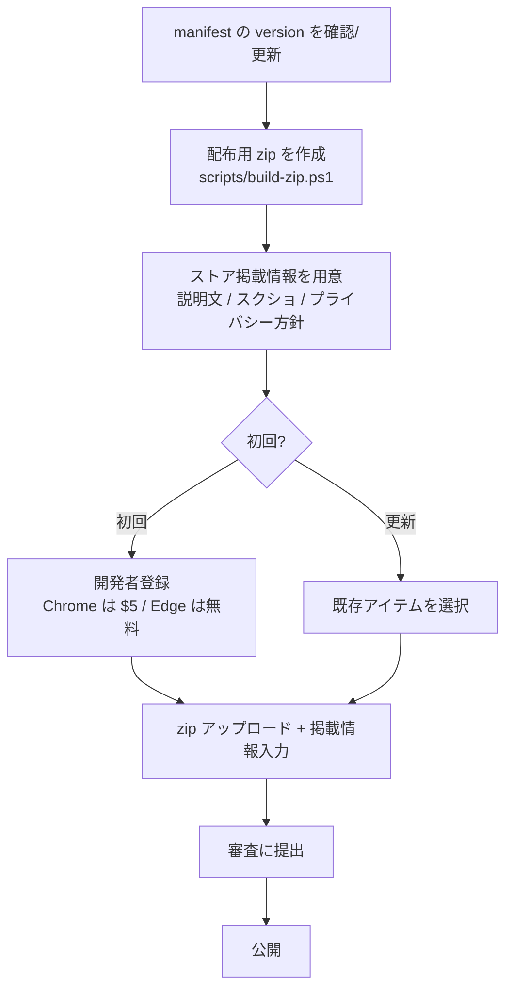

# 配布準備手順（Chrome Web Store / Edge Add-ons）

nonbiri-bird をストアへ申請・配布するための手順をまとめる。
本書は **リポジトリ側で準備できる範囲** を対象とする。
実際の開発者登録・支払い・申請フォーム入力は **ユーザー操作** であり、本書はその前段の準備とチェックリストである。

対応 Issue: #14

---

## 0. 全体像



- **初回登録だけがユーザー操作の壁**（Chrome: 一度きり $5、Edge: 無料）。
- 2 回目以降は「version を上げた zip を再アップロード → 審査」を繰り返すだけ。

---

## 1. version 運用

ストアは **同じ version の再アップロードを拒否する**。リリースのたびに version を上げる。

- `manifest.json` の `"version"` が唯一の正（package.json の version は npm 用なので揃えておくと混乱しない）。
- 形式は `メジャー.マイナー.パッチ`（例 `0.2.0`）。数値のみ、各桁 0〜65535。
- 上げ方の目安:
  - パッチ（バグ修正・微調整）→ `0.2.0` → `0.2.1`
  - マイナー（機能追加）→ `0.2.1` → `0.3.0`
  - メジャー（大きな変更）→ `0.x` → `1.0.0`
- **リリースのたびに `manifest.json` と `package.json` の両方を更新**し、コミットしてからタグを打つと履歴が追いやすい（例 `git tag v0.2.1`）。

> 重要: ストアに出したことのある version 番号は二度と使えない。下げる・使い回すは不可。

---

## 2. 配布用 zip の作成

手作業で zip すると `.git` や `node_modules`、生成スクリプトを混入させがちなので、
**ホワイトリスト方式のスクリプト**で作る。

```powershell
pwsh ./scripts/build-zip.ps1
# => dist/nonbiri-bird-<version>.zip
```

> PowerShell 7 が無い環境では `pwsh` の代わりに `powershell ./scripts/build-zip.ps1` でも動く
> （スクリプトは Windows PowerShell 5.1 互換の API のみ使用）。

- スクリプトは `manifest.json` の version を読み、`dist/nonbiri-bird-<version>.zip` を出力する。
- 同梱されるのは以下だけ（これ以外は zip に入らない）:
  - `manifest.json`
  - `popup.html` / `popup.js`
  - `src/`（`content.js` / `logic.js`）
  - `icons/` の `*.png` のみ
- **除外される**もの（ストアに不要・入れてはいけない）:
  - `.git/`, `node_modules/`, `dist/`
  - `research/`, `summary/`, `test/`
  - `icons/generate_icons.py`, `icons/requirements.txt`
  - `README.md`, `PRIVACY.md`, `package.json` 等の開発用ファイル

### 中身の確認

スクリプトは作成後に同梱ファイル一覧を表示する。秘密情報・不要物が無いことを毎回ここで確認する。
さらに zip を展開し、`chrome://extensions` でデベロッパーモードをオンにして
「パッケージ化されていない拡張機能を読み込む」から展開後フォルダを選んで動作確認してから提出するとよい。

---

## 3. ストア掲載情報

### 3.1 説明文

- **短い説明 / Summary（〜132 文字程度）**:
  > 鳥がブラウザ内をランダムに、のんびりと、たまーに飛ぶ癒し系の常駐演出。クリックは透過し操作の邪魔をしません。
- **詳細説明 / Description**（例。README の現状説明をベースに）:
  > 全ページの「上空」に、白いドット絵の鳥が 1〜10 羽、緩急をつけてのんびり飛びます。
  > 鳥は遠近で大きさ・濃さ・速度が変わり、空にいる数も時々変化します。
  > クリックは透過するのでページ操作の邪魔になりません。
  > ポップアップから鳥の最大数・出現頻度を調整でき、特定サイトを除外できます。
  > `prefers-reduced-motion`（視差効果を減らす）設定時や非表示タブでは飛びません。
  > 外部通信・トラッキングは一切ありません。

### 3.2 スクリーンショット

- Chrome Web Store: **1280×800** または **640×400**（最低 1 枚、最大 5 枚）。
- Edge Add-ons: **1280×800** 推奨（最低 1 枚）。
- 撮り方の案:
  1. 暗め（ダークモード）のページで鳥が複数飛んでいる画面 — 白い鳥が映える主役カット。
  2. ライト背景のページで薄い影とともに飛ぶ画面。
  3. ポップアップ設定 UI を開いた画面（最大数・頻度・除外）。
- 鳥はアニメーションなので、複数羽が見えるタイミングでキャプチャする。

### 3.3 アイコン

- ストア掲載用に **128×128** の `icons/icon128.png` を使用（#13/#16 で整備済み）。
- 申請フォームでは別途「ストアアイコン」を求められる場合がある。同じ 128px を流用可。

### 3.4 プライバシー方針

- リポジトリの [`PRIVACY.md`](../PRIVACY.md) を正とする。GitHub 上の URL を申請フォームに記入する:
  - `https://github.com/bubbleShaker/nonbiri-bird/blob/master/PRIVACY.md`
- **権限の説明（審査・ユーザー向けに重要）**:

  | 権限 | 実際の用途 | 申請フォームでの説明例 |
  |---|---|---|
  | `storage` | `chrome.storage.sync` に表示設定（最大数・頻度・除外サイト）を保存・同期 | ユーザーの表示設定をブラウザに保存・同期するため。外部送信なし。 |
  | `activeTab` | ポップアップの「このサイトを除外」クリック時に、現在タブのホスト名のみ取得 | 「このサイトを除外」操作時に現在のタブのホスト名を取得するため。クリック時のみ・URL は除外リスト作成にのみ使用し送信しない。 |

  - `<all_urls>` の content script を使う理由（聞かれたら）: 全ページ上空に演出を出すのが拡張の主機能のため。ページ内容の読み取り・送信は行わない。
  - データ収集の申告: **「収集しない / 販売しない / 用途外利用しない」** を選択（PRIVACY.md と整合）。

---

## 4. 申請（ユーザー操作）

> ここから先はアカウント・支払いを伴うためユーザーが実施する。リポジトリ側の準備（1〜3）が済んでいれば入力するだけ。

### Chrome Web Store

1. [Chrome Web Store Developer Dashboard](https://chrome.google.com/webstore/devconsole) にアクセス。
2. 初回のみ開発者登録（**一度きり $5**）。
3. 「新しいアイテム」→ `dist/nonbiri-bird-<version>.zip` をアップロード。
4. 掲載情報（説明文・スクショ・カテゴリ・言語）、プライバシー（権限説明・データ利用の申告・PRIVACY.md の URL）を入力。
5. 「審査のために送信」。審査通過後に公開。

### Edge Add-ons

1. [Microsoft Partner Center](https://partner.microsoft.com/dashboard/microsoftedge) にアクセス。
2. 開発者登録（**無料**）。
3. 「新しい拡張機能を作成」→ 同じ zip をアップロード。
4. 掲載情報・プライバシー方針 URL を入力して提出。

---

## 5. 再リリース手順（更新）

更新も毎回審査が入るが、初回登録は不要。以下を繰り返す。

1. コードを修正してマージ。
2. `manifest.json` と `package.json` の `version` を上げる（→ §1）。コミット。
3. `pwsh ./scripts/build-zip.ps1` で新しい zip を作成。
4. ダッシュボードで対象アイテムを開き、**「新しいパッケージをアップロード」** で zip を差し替え。
5. 変更があれば掲載情報・スクショを更新し、審査に提出。
6. 公開後、ユーザーには自動更新で配信される。

> ロールバックは「以前の version 番号に戻す」ことはできない。問題があれば修正版を新しい version で出し直す。

---

## チェックリスト（提出前）

- [ ] `manifest.json` の version を上げた（過去に出した番号ではない）
- [ ] `package.json` の version も揃えた
- [ ] `pwsh ./scripts/build-zip.ps1` を実行し、同梱一覧に不要物・秘密情報が無いことを確認した
- [ ] `PRIVACY.md` が master にマージ・push 済みである（申請フォームに記入する URL が 404 にならない）
- [ ] zip を読み込んで実機（Chrome/Edge）で動作確認した
- [ ] スクリーンショット（1280×800）を用意した
- [ ] 説明文（短い/詳細）を用意した
- [ ] PRIVACY.md の URL と権限説明を申請フォーム用に確認した
